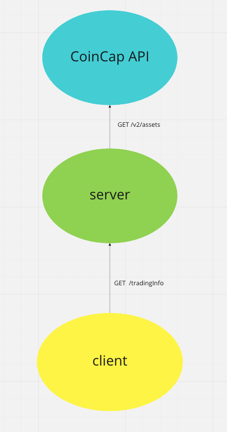

## Start guide

```
# run server
cd server
npm ci
npm run dev

# run client
cd ../client
npm ci
npm start
```

Node 16 is recommended as client is scaffolded by create-react-app, lower Node version will cause `npm run test` to fail. If you use nvm to manage Node version, simply run `nvm use`.

## Architecture



## Due to time constrain I wanted to do these but I didn't:

- extract a /shared folder to put type definitions and mocks for /client and /server to use
- move start scripts to root folder
- server unit tests
- build and production related scripts
